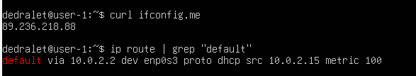

## Part 1. Installation of the OS

**== Task ==**

##### Install **Ubuntu 20.04 Server LTS** without GUI. (Use VirtualBox).
- There should be no GUI.
- Check Ubuntu version by running the command \
  `cat /etc/issue`
- Add a screenshot of the command output to the report.

### == Result ==

## Part 2. Creating a user

"An installed system is a good thing, but what if someone else uses it? I'll teach you how to create a new user."

**== Task ==**

##### Create a user other than the one created during installation. The user must be added to `adm` group.
- Add a screenshot of command call to create user.
- The new user must be in the output of the command: \
  `cat /etc/passwd`
- Add a screenshot of the command output.

### == Actions taken & Result ==

## Part 3. Setting up the OS network

**== Task ==**

##### Set the machine name as user-1
##### Set the time zone corresponding to your current location.

##### Output the names of the network interfaces using a console command.
- In the report give an explanation for the presence of the lo interface.
##### Use the console command to get the ip address of the device you are working on from the DHCP server.
- Decode DHCP in the report.
##### Define and display the external ip address of the gateway (ip) and the internal IP address of the gateway, aka default ip address (gw).
##### Set static (manually set, not received from DHCP server) ip, gw, dns settings (use public DNS servers, e.g. 1.1.1.1 or 8.8.8.8).

##### Reboot the virtual machine. Make sure that the static network settings (ip, gw, dns) correspond to those set in the previous point.
- Describe in the report what you have done to complete all seven points (you can do it in text or with screenshots);
- Successfully ping 1.1.1.1 and ya.ru remote hosts and add a screenshot of the output command to the report. There should be "0% packet loss" phrase in command output.

### == Actions taken & Results ==

**1st point:**  Used tool named *hostnamectl*. Full command to set machine name to *user-1*: `sudo hostnamectl set-hostname user-1`.

**2nd point:**  I used tool *timedatectl* to set system time corresponding to my time zone, which is Tashkent. What did i write: `sudo timedatectl set-timezone Asia/Tashkent`, that's all.

**3rd point:**

The "lo" (loopback) interface is a special virtual network interface which allows a computer to communicate with itself.

**4th point:**

There, the IP address of my device from the DHCP server is equal to *10.0.2.15* . And DHCP stands for "Dynamic Host Configuration Protocol", and the DHCP server uses this protocol to automatically handle networking stuff.

**5th point:**

The *ip* (internal IP address of the gateway) is the address of the device inside the local network. With it, devices connected in the same local network can interact with each other. On the other hand, the *gw* (external IP address of the gateway), is the unique address given by the ISP (Internet Service Provider). It lets your device interact with non-local devices that are connected to the outside network (e.g. the internet).

Here, in the image above, we can see the gw (first of two addresses) and ip of my server, respectively.

**6th point:**

*Netplan* is the default tool for configuring networking on Ubuntu servers. So I used it to manually set a static ip, gw, and DNS. After editing the configuration file, I applied the changes using the `sudo netplan apply` command and then rebooted the server.

**7th point:**

## Part 4. OS Update

"You're probably wondering, 'Is the system ready now?' It's not ready at all! We haven't updated it to the latest version yet."

**== Task ==**

##### Update the system packages to the latest version
- After updating the system packages, if you enter the update command again, a message should appear saying there are no updates;
- Add a screenshot of this message to the report.

### == Result ==

## Part 5. Using the **sudo** command

"How often were you told as a child that you forgot to say the 'magic' word? One of those 'magic' words was 'please'. Linux has its counterpart – _sudo_. The system won't perform some operations until it hears the 'magic' word."

**== Task ==**

##### Allow user created in [Part 2](#part-2-creating-a-user) to execute sudo command.
- In the report explain the *true* purpose of sudo command (don’t write about the fact that this word is "magic" one);
- Change the OS hostname via the user created in [Part 2](#part-2-creating-a-user) (using sudo);
- Add screenshot with changed hostname to the report.

### == Actions & Results ==

*sudo* ("superuser do") is the command which allows a permitted user to execute commands with partial/full (defined inside the *sudoers* file) system-wide privileges for the duration of the command.

## Part 6. Installing and configuring the time service

"Although we have the correct time now, it may not always be that way. To avoid having to set it every time yourself, there are time sync services."

**== Task ==**

##### Set up the automatic time synchronisation service.
- Output the time of the time zone in which you are currently located.
- The output of the following command must contain `NTPSynchronized=yes`: \
  `timedatectl show`
- Add screenshots of the correct time and command output to the report.

### == Results ==

## Part 7. Installing and using text editors

"I think we're ready to move on to one of the scariest parts."

You’re pointing toward the Netherlands on the map of the world hanging on the wall.

"Here, Bram Moolenaar has unraveled the mysteries of harmony and inner concentration. \
This is where the first version of VIM was released on 2 November 1991. \
Do you want to learn how to work in VIM?"

"Yes..."

"Then I am your master."

"OK..."

"Just don't cry."

"I won’t..."

**== Task ==**

##### Install **VIM** text editor (+ any two others if you like **NANO**, **MCEDIT**, **JOE** etc.)

##### Using each of the three selected editors, create a *test_X.txt* file, where X is the name of the editor in which the file is created. Write your nickname in it, close the file and save the changes.
- Add screenshots to the report:
    - Of each editor with the contents of the file before closing;
- Write down in the report what you have done to exit with the changes saved.

##### Using each of the three selected editors, open the file for editing, edit the file by replacing the nickname with the "21 School 21" string, close the file without saving the changes.
- Add screenshots to the report:
    - Of each editor with the contents of the file after editing;
- Write down in the report what you have done to exit without saving the changes.
##### Using each of the three selected editors, edit the file again (similar to the previous point) and then master the functions of searching through the contents of a file (a word) and replacing vima word with any other one.
- Add screenshots to the report:
    - Of each editor with word search results;
    - Of each editor with commands entered to replace a word with another.

### == Actions taken & Results ==

**2nd point:**

For the nano, I saved the state of file using *Ctrl + O* and exit using *Ctrl + X* shortcuts.
For the neovim, firstly I pressed letter *i* for entering insert mode. After writing my nickname, i switched to normal mode pressing *Shift + Esc*, than typed *:wq*.
Vim and NeoVim share the same processes, so i write only about one from here on now.

**3rd point:**

For the nano, I pressed ust *Ctrl + X*, then editor asked me for to save modified buffer, I pressed letter *N* standing for "No" option.

For the vim, I entered *:q!* on normal mode to quit without saving changes.

**4th point:**

I won't upload screenshots for this part, because i don't want to )

For the nano, i searched word using *Ctrl + W* combinations. When it comes to editing, i did the following one-by-one: *Ctrl + \*, wrote the needed word, pressed Enter, then entered another word to replace the first word, editor asked me to change the whole word or the searched part, I choosed the searched part. That's all.

For the nvim, I wrote */searched_word*, pressed Enter, wrote *ciw* (if you want to change part of the word, *cw*), pressed Enter, then wrote another word to replace the searched word.

## Part 8. Installing and basic setup of the **SSHD** service

"It's convenient to have access from one computer to another over a network, isn't it? But to make it not only convenient, but also safe, you should use SSH service."

**== Task ==**

##### Install the SSHd service.
##### Add an auto-start of the service whenever the system boots.
##### Reset the SSHd service to port 2022.
##### Show the presence of the sshd process using the ps command. To do this, you need to match the keys to the command.
- Explain in the report the meaning of the command and each key in it.
##### Reboot the system.
- Describe in the report what you have done to complete all five points (you can do this in text or with screenshots);
- The output of the netstat -tan command should contain \
  `tcp 0 0.0.0.0:2022 0.0.0.0:* LISTEN` \
  (if there is no netstat command, it needs to be installed);
- Add a screenshot of the command output to the report;
- Explain the meaning of the -tan keys, the value of each output column, the value 0.0.0.0. in the report.

### == Actions taken & Results ==

**1st point:**

SSHD-server can be installed by a command `sudo apt-get install openssh-server`.

**2nd point:**

If we just enable SSH service, that's enough - `sudo systemctl enable ssh`

**3rd point:**

For resetting default port number, I opened */etc/ssh/sshd_config* file and edited the *Port 22* part.

**4th point:**

`ps` is a command which outputs process statuses. By default, it only prints processes running in the current shell. The *-a* flag makes `ps` include all the processes associated with other terminals also. The *-x* flag makes `ps` include processes that are not associated with any terminal. The *-u* flag adds a column showing which user's processes they are.

**5th point:**

*-t* flag displays only TCP connections, *-a* flag shows all the listening and non-listening sockets and *-n* flag displays numerical addresses and port numbers instead of resolving hostnames and service names.

Listening *0.0.0.0* means that the program is listening on all the IPv4 addresses assigned to machine, whereas *127.0.0.1* is a loopback network interface address that only accessible from current machine.

## Part 9. Installing and using the **top**, **htop** utilities

"If I were asked what useful things **top** and **htop** utilities do, I would answer in one word: everything."

**== Task ==**

##### Install and run the top and htop utilities.
- From the output of the top command determine and write in the report:
    - uptime
    - number of authorised users
    - average system load
    - total number of processes
    - cpu load
    - memory load
    - pid of the process with the highest memory usage
    - pid of the process taking the most CPU time
- Add a screenshot of the htop command output to the report:
    - sorted by PID, PERCENT_CPU, PERCENT_MEM, TIME
    - filtered for sshd process
    - with the syslog process found by searching
    - with hostname, clock and uptime output added

### == Results ==

**1st point:**

- uptime:                                            3 minutes
- number of authorised users:                        1
- average system load:                               0.17
- total number of processes:                         202
- CPU load:                                          4.3
- memory load:                                       14.5
- PID of the process with the highest memory usage:  1825
- PID of the process taking the most CPU time:       1825

**2nd point:**

htop outputs sorted by PID:

htop outputs sorted by PERCENT_CPU:

htop outputs sorted by PERCENT_MEM:

htop outputs sorted by PERCENT_TIME:

htop outputs filtered for *sshd* process:

*syslog* process found by searching:

hostname, clock and uptime added to htop output:

## Part 10. Using the **fdisk** utility

"Now let's figure out how to get information about your hard disk. Especially for you I've put together a couple of examples of how to use the fdisk utility."

**== Task ==**

##### Run the fdisk -l command.
- In the report write the name of the hard disk, its capacity and number of sectors, and also the swap size.

### == Action & Result ==

The name of the hard disk is */dev/sda*. It has a capacity of 48 GiB and contains 100,663,296 sectors. I don’t have a swap partition.

## Part 11. Using the **df** utility

"We got the information about the hard disk, but often it is much more interesting to get information about the disk space, which can be obtained with the df utility."

**== Task ==**

##### Run the df command.
- In the report write for the root partition (/):
    - partition size
    - space used
    - space free
    - percentage used
- Determine and write the measurement unit in the report.

##### Run the df -Th command.
- In the report write for the root partition (/):
    - partition size
    - space used
    - space free
    - percentage used
- Determine and write the file system type for the partition in the report.

### == Results ==

**1st point:**

- Partition size:   23558544 1K-blocks
- Space used:       10712296 units
- Space free:       11624208 units
- Percentage used:  48%

It seems measurement unit is *Kibibytes* (KiB), but when I calculated some parts, it didn't match.

**2nd point:**

- Partition size:   23 GiB
- Space used:       11 GiB
- Space free:       12 GiB
- Percentage used:  48%

File system type for the partition is *ext4*.

## Part 12. Using the **du** utility

"df is not the only way to get information about disk space. I'll tell you about another one."

**== Task ==**

##### Run the du command.
##### Output the size of the /home, /var, /var/log folders (in bytes, in human readable format)
##### Output the size of all contents in /var/log (not the total, but each nested element using *)
- Add screenshots with the output of all used commands to the report.

### == Actions & Results ==

**1st point:**

*-s* is here for not to show sizes of subdirectories.

Why didn't I use *--block-size=1* with the *-h* option at once? It seems the *-h* option discards it, so I had results separated.

**2nd point:**

## Part 13. Installing and using the **ncdu** utility

"You probably didn’t like much the format in which the du command outputs information. I understand you perfectly. So now we'll take a look at its improved version."

**== Task ==**

##### Install the ncdu utility.
##### Output the size of the /home, /var, /var/log folders.
- The size should be approximately the same as in [Part 12](#part-12-using-the-du-utility);

- Add screenshots of the used commands to the report.

### == Actions & Results ==

I used *sudo* for better accuracy.

## Part 14. Working with system logs

"A system administrator sometimes needs to review events which happened in a system in the recent past. Linux has system logs for that."

**== Task ==**

##### Open for viewing:
##### 1. /var/log/dmesg
##### 2. /var/log/syslog
##### 3. /var/log/auth.log
- Write the last successful login time, user name and login method in the report;
- Restart SSHd service;
- Add a screenshot of the service restart message to the report (search for it in the logs).

### == Actions & Results ==

**1st point:**

- The last succesful login time:  22:00:30
- The last logged user:           dedralet
- The login method:               login  (login via TTY)

I have found the 1st and 2nd parameters inside the */var/log/syslog* file, then searched for the login method in the */var/log/auth.log* file. And I found all the answers to the things asked above.

**2nd point:**

## Part 15. Using the **CRON** job scheduler

"Phew, we finally got to the last part of my long narrative. I will now show you the program, which, among other things, noticeably simplifies the periodic invocation of other programs."

**== Task ==**

##### Using the job scheduler, run the uptime command in every 2 minutes.
- Find lines in the system logs (at least two within a given time range) about the execution;
- Display a list of current jobs for CRON;
- Add screenshots of the execution lines and the list of current tasks to the report.

##### Remove all tasks from the job scheduler.
- Add a screenshot of the list of current tasks for CRON to the report.

### == Results ==

Believe me, I removed all the cron jobs. Just didn't want to upload proof.
