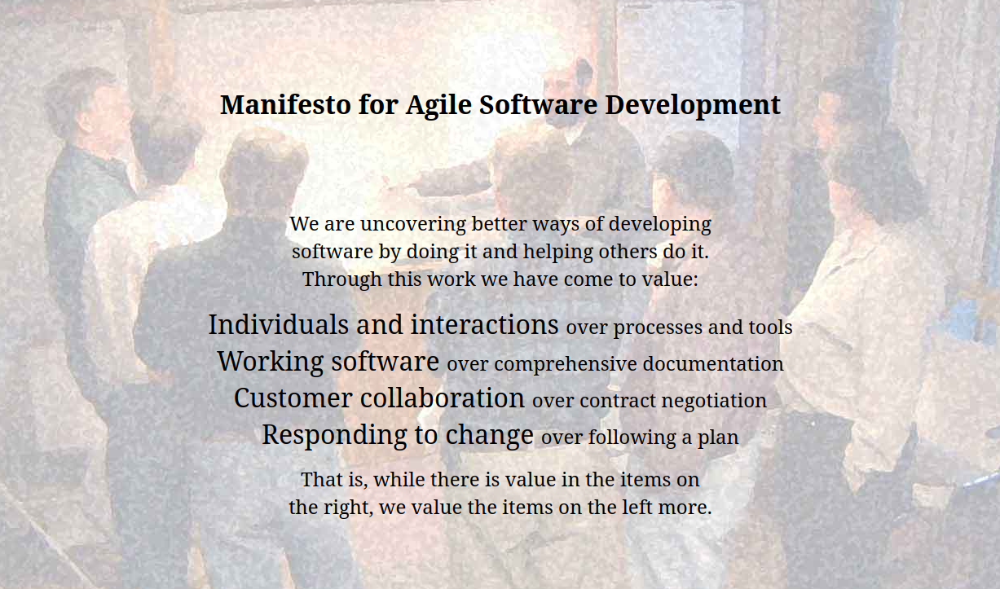

### Task 3. Software Development Life Cycle

1. Study the following software development methodologies (it is especially important to understand the advantages and disadvantages of each methodology):
    - Waterfall model;
    - V-model;
    - Incremental model;
    - Scrum;
    - Kanban.
2. Write down the pros and cons of each of the above methodologies. The format of execution is free. The only condition: the description should be understandable not only to you, but also to anyone who will read it.
3. Study what the “Agile Manifesto” is (for example here: <https://agilemanifesto.org/>) and write down the 4 main ideas of this manifesto with a short explanation of how you understood them. Be sure to pay attention to the phrase *“That is, while there is value in the items on the right, we value the items on the left more.”* Give a short description of this phrase as well.
4. Submit the completed task in a file named *task_3.md*.

### Answers

2. Pros & Cons of methodologies:
    - Waterfall model:
        - pros:
            - easy to maintain if documentation is well specified.
            - suitable for smaller and short-term projects.
        - cons:
            - testing cycle comes too late, after the whole project is written.
            - too slow and expensive for larger, complex or long-term projects.
    - V-model:
        - pros:
            - every step must be checked and all the erros are fixed at every stage
            - strongly prioritized methodology
        - cons:
            - consumes too much time and money
            - hard to go back after some time
            - not suitable for complex and long-term large projects, since documentation changes after times.
    - Incremental model:
        - pros:
            - easy to maintain if documentary is well specified, since every stage is a smaller piece of the big picture
            - development team can build the next version before the current one is released.
            - customers can react to every version of the product.
            - can be used for long-term projects.
        - cons:
            - can't be used for very complex projects unless good planning and architecture granted.
            - integration can get messy, over increments overall cost can increase.
    - Scrum:
        - pros:
            - can be used for complex projects with changing documentations over time.
            - offers faster development.
            - each team knows what other teams are doing right know, so it offers adaptability.
            - issues can be fixed much faster.
        - cons:
            - requires more resurces and money.
            - can fail without a good product owner and team.
    - Kanban:
        - pros:
            - easy to see all the tasks at once, even from other teams.
            - can lead to continuous improvement.
            - easy to see the big picture.
        - cons:
            - no built-in strategy.
            - may lead to problems with undisciplined teams.
            - can't predict when work will be finished.

3. 4 main ideas of *"Agile manifesto"*:
    1. "Our highest priority is to satisfy the customer through early and continuous delivery of valuable software." Without a satisfied customer - we lose.
    2. "Build projects around motivated individuals. Give them the environment and support they need, and trust them to get the job done." There is no stronger force than motivated humans. If you give the work to a team that loves their work, you can get the perfect result with perfect timing.
    3. "Simplicity — the art of maximizing the amount of work not done — is essential." The fewer unfinished tasks, the more chance to improve the actual product.
    4. "The most efficient and effective method of conveying information to and within a development team is face-to-face conversation." While communicating, we can ensure that we can understand each other properly. It's easier to discuss and create new ideas while face-to-face conversation.

- All the items on the right have a certain value. But we need them only to reach the items on the left, so they shouldn't be our top priority.
